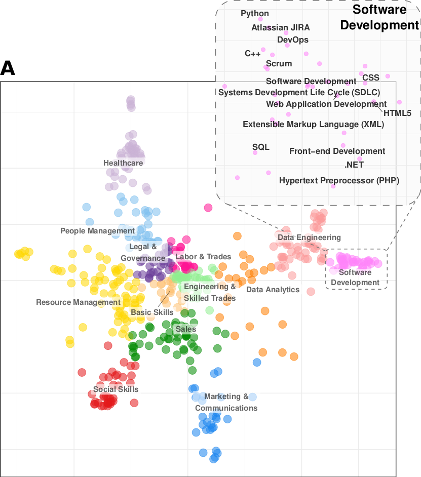
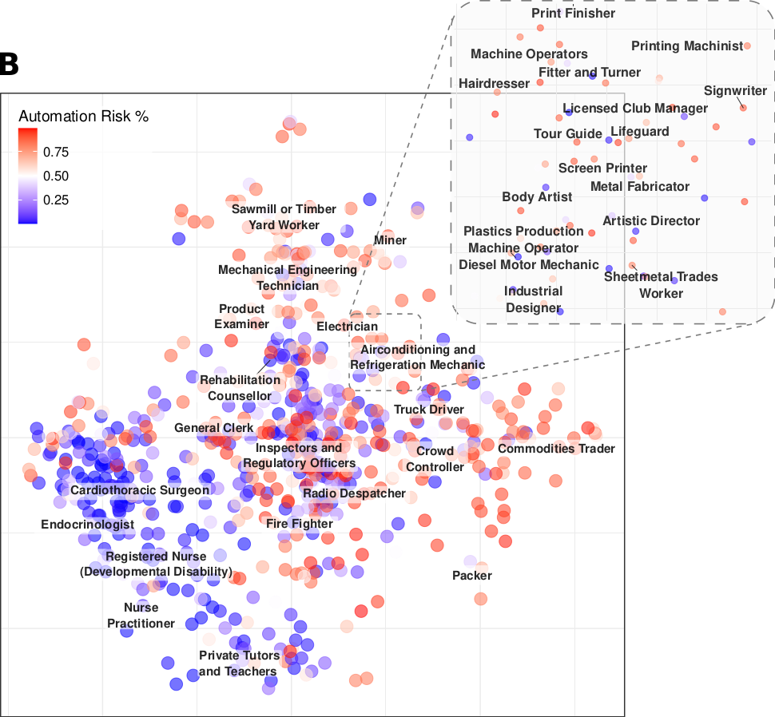
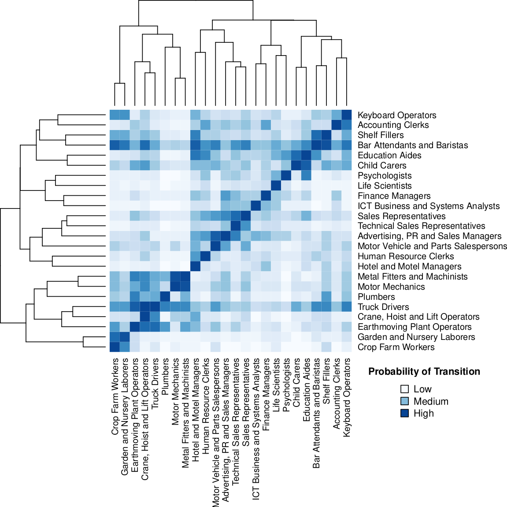
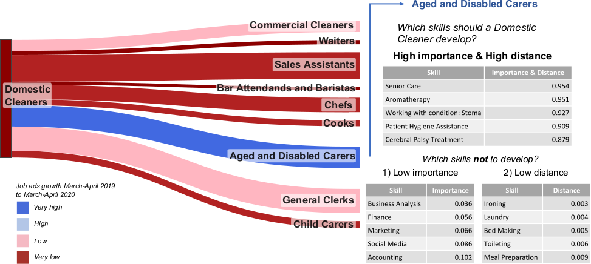
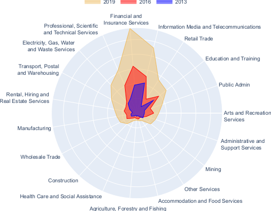

**Summary:**

*   We build a machine learning-based _Job Transitions Recommender System_ that can accurately predict the probability of transitioning between occupations. We showcase the system for workers forced to transition between jobs.
*   The system is based on a novel data-driven method to measure the similarity between occupations based on their underlying skill profiles and real-time job ads.
*   We also build a leading indicator of Artificial Intelligence adoption in Australian industries, outlining gaps, opportunities, and trends.
*   For full technical details, please read the [pre-print](https://arxiv.org/abs/2011.11801).

People are forced to change jobs as new technologies automate labour, production is moved abroad, and economic crises unfold. Successfully transitioning between jobs, however, requires leveraging current skills and acquiring others, which can falter if the skills gap is too large. 

In our latest research, [Nik Dawson](authors/nik-dawson/) and [Marian-Andrei Rizoiu](authors/ma-rizoiu/) (together with collaborator [Mary-Anne Williams](https://research.unsw.edu.au/people/professor-mary-anne-williams)) and I developed a novel method to measure the 'distance' between _sets of skills_ using real-time job ads data. We then use these measures to build a recommender system that accurately predicts the probability of transitioning from one occupation to every other possible occupation. Intuitively, two occupations have a high probability of successfully transitioning when their skill sets are highly similar (i.e. the distance is small). For example, an Accountant has a high probability of transitioning to become a Financial Analyst because their skill sets are similar; whereas a Speech Therapist has a low transition probability to becoming a Financial Analyst as their skill sets are very different. This isn't to say that it's not possible. Rather, the skills gap is large, so the probability of successfully transitioning is diminished. 

The SKILL SPACE Method
---

**Distance between skills**

In order to measure the distance between occupations from their underlying skill sets, we first measure the distance between individual skills in job ads for each calendar year from 2012-2020. To achieve this bottom-up approach, we first use a method from Trade Economics, called ‘Revealed Comparative Advantage' (RCA), to identify how important an individual skill is to a job ad (i.e. comparative advantage). Then, after some normalisation, we calculate the pairwise similarity between every skill for each year. The image below shows the skill distance embeddings for the top 500 skills by posting frequency in 2018.

Here, each marker represents an individual skill that is coloured according to one of 13 clusters of highly similar skills. As seen in the Software Development cluster (see inset), highly similar skills cluster closely together, such as ‘Python' and ‘C++'. The skills map also provides useful insights, highlighting that specialised skills (such as ‘Software Development' and ‘Healthcare') tend to lay toward the edges of the embedding, whereas more general and transferable skills lay toward the middle, acting as a ‘bridge' to specialist skills.

**Distance between occupations**

Next, we use the pairwise skill distances to measure the distance between _sets of skills_. In this example, we define sets of skills by their occupational groupings. But they can just as easily be defined by other groupings, such as companies, industries, or personalised skill sets. We calculate the distance between skill sets as the weighted average similarity between the individual skills in each set, where the weights correspond to the skill importance in their respective sets. The figure below visualises the distance between Australian occupations in 2018.

Each occupation is represented by a marker and coloured on a scale according to their automation susceptibility, as calculated by [Frey and Osborne](https://www.sciencedirect.com/science/article/abs/pii/S0040162516302244) - dark blue represents low-risk probability and dark red shows high risk probability over the coming two decades. As seen in the magnified inset, similar occupations lie close together on the map. Further, occupations in low risk of automation tend to be characterised by non-routine, interpersonal, and/or high cognitive labour tasks; whereas occupations in high risk of automation tend to require routine, manual, and/or low cognitive labour tasks. For example, in the inset of the Figure above, a ‘Sheetmetal Trades Worker' is deemed to be at high risk of labour automation (82% probability) due to high levels of routine and manual labour tasks required by the occupation. However, the skill set demands of a ‘Sheetmetal Trades Worker' are highly similar to an ‘Industrial Designer', which is considered at low risk of labour automation over the coming two decades (4% probability). Therefore, an ‘Industrial Designer' represents a transition opportunity for a ‘Sheetmetal Trades Worker' that leverages existing skills and protects against potential risks of technological labour automation.

Constructing a Job Transitions Recommender System
---

The SKILL SPACE Method described above achieves high levels of accuracy in predicting job transitions. However, these are symmetric measures and we know that **job transitions are _asymmetric_** - it is more difficult to transition between jobs in one direction than the other. Therefore, transitions are determined by more than the symmetric distance between skill sets; other factors, such as educational requirements and experience demands, contribute to these asymmetries. 

We account for the asymmetries between job transitions by training a machine learning classifier model that combines the SKILL SPACE distance measures with other labour market variables from job ads data and employment statistics (see the [pre-print](https://arxiv.org/abs/2011.11801) for full details). Our machine learning model is trained against a dataset of ‘actual' (i.e. real life) job transitions from an Australian longitudinal household survey. We then apply the trained model to predict the probability for every possible occupational transition in the dataset - described as the transition probability between a ‘source' and a ‘target' occupation. This creates the _Transitions Map_, for which a subset of 20 occupations can be seen in the figure below.

The coloured heatmap shows the transition probabilities (‘source' occupations are in columns and ‘targets' are in rows). Dark blue represents higher transition probabilities and lighter blue shows lower probabilities, where the asymmetries between occupation pairs are clearly observed. For example, a ‘Finance Manager' has a higher probability of transitioning to become an ‘Accounting Clerk' than the reverse direction. Moreover, transitioning to some occupations is generally easier (for example, ‘Bar Attendants and Baristas') than others (‘Life Scientists'). The dendrogram (the lines on the left and top of the chart) illustrates the hierarchical clusters of occupations where there is a clear divide between service-oriented professions and manual labour occupations.

Our model achieves high levels of performance, **accurately predicting 76% of occupational transitions**. 

Recommending Jobs and Skills
---

The _Transitions Map_ provides the basis for making qualified job transition recommendations.  We call this the _Job Transitions Recommender System_. In the figure below, we highlight the example of `Domestic Cleaners', an occupation that has experienced significant declines in labour demand and employment levels during COVID-19 in Australia.

First, we use the _Transitions Map_ to recommend the occupations with the highest transition probabilities; these are the named occupations on the right side of the flow diagram, ordered in descending order of transition probability. Segment widths show the labour demand for each of the recommended occupations during the beginning of the COVID-19 period (measured by posting frequency). The segment colours represent the percentage change of posting frequency during March and April 2019 compared to the same months in 2020; dark red indicates a big decrease in job ad posts and dark blue indicates a big increase. The first six transition recommendations for ‘Domestic Cleaners' all experienced negative demand, which is unsurprising given that ‘non-essential' services were restricted in Australia during this period. However, the seventh recommendation, ‘Aged and Disabled Carers', had significantly grown in demand during the beginning of the COVID-19 period and there was a high number of jobs advertised. Given that it is generally favorable to transition to high demand jobs, we selected ‘Aged and Disabled Carers' as the target occupation for this example.

**Skill recommendations for target occupations**

We then take the _Job Transitions Recommender System_ a step further by incorporating skill recommendations. Transitioning to a new occupation generally requires developing new skills under time and resource constraints. Therefore, workers must prioritise which skills to develop. We argue that a worker should invest in developing a skill when (1) the **skill is important to the target occupation** _and_ (2) the **distance to acquire the skill is large** (that is, it is relatively difficult to acquire). In the case of the ‘Domestic Cleaner' in the figure above, the top recommended skills to assist in the transition to the ‘Aged and Disabled Carer' occupation are specialised patient care skills, such as ‘Patient Hygiene Assistance'.  Conversely, the reasons _not_ to develop a skill are when (1) the **skill is not important** _or_ (2) the **distance is small to the target occupation**. The figure shows that while some ‘Aged and Disabled Carer' jobs require ‘Business Analysis' and ‘Finance' skills, these skills are of low importance for the ‘Aged and Disabled Carer' occupation, so they should not be prioritised. Similarly, skills such as ‘Ironing' and ‘Laundry' are required by ‘Aged and Disabled Carer' jobs but the distance is small, so it is likely that either a ‘Domestic Cleaner' already possesses these skills or they can easily acquire them. 

Developing a Leading Indicator of AI Adoption
---

The SKILL SPACE method can also be flexibly applied to other adjacent problems, such as identifying the extent of specific skill gaps of firms within industries and potential adoption of new technologies. Here, we develop a leading indicator for emerging technology adoption and potential labour market disruptions based on skills data, using Artificial Intelligence (AI) as an example. We select AI because of its potential impacts on transforming labour tasks and accelerating job transitions. By applying SKILL SPACE, we were able to measure the yearly similarities between an adaptive set of AI skills against each of the 19 Australian industries from 2013-2019 (see the [pre-print](https://arxiv.org/abs/2011.11801) for technical details). As industry skill sets become more similar to AI skills, the skills gap is diminished and firms within industries are more likely to possess the skills to make productive use of AI technologies. The growth of AI skill similarity within industries is shown by the coloured areas of the radar chart below.

All industries have increased their similarity levels to AI skills. This highlights the growing importance of AI skills across the Australian labour market. However, the rates of similarity are unequally distributed. Some industries, such as ‘Finance and Insurance Services' and ‘Information Media and Telecommunications' command much higher rates of AI skill similarity. This indicates that not only are firms within these industries increasingly demanding AI skills but also that the AI skills gaps within these industries are much smaller. Therefore, it is likely that firms within these industries are adopting AI and making productive use of these technologies.

Also noteworthy are the differences in growth rates toward AI skill similarity. As the figure above clearly shows, AI skill similarity has rapidly grown for some industries and more modestly for others. For instance, ‘Retail Trade' has experienced the highest levels of growth in similarity to AI skills, increasing by 407% from 2013 to 2019. The majority of this growth has occurred recently, which coincides with the launch of Amazon Australia in 2017. Since then, Amazon has swiftly hired thousands in Australia. This indicator can assist policy-makers and businesses to robustly monitor the growth of AI skills (or other emerging technologies), which acts as a proxy for AI adoption within industries.

Conclusion
---

While the future of work remains unclear, change is inevitable. New technologies, economic crises, and other factors will continue to shift labour demands causing workers to move between jobs. If labour transitions occur efficiently, significant productivity and equity benefits arise at all levels of the labour market; if transitions are slow, or fail, significant costs are borne to both the State and the individual. Therefore, it's in the interests of workers, firms, and governments that labour transitions are efficient and effective. The methods and systems we put forward here could significantly improve the achievement of these goals.

For the full technical details, please read the [pre-print](https://arxiv.org/abs/2011.11801).

**Acknowledgements**

We thank [Bledi Taska](https://www.linkedin.com/in/bleditaska?lipi=urn%3Ali%3Apage%3Ad_flagship3_pulse_read%3Bvr7rCfoNTVGsSR9hhmd%2FhQ%3D%3D) and [Davor Miskulin](https://ca.linkedin.com/in/dmiskulin) from Burning Glass Technologies for generously providing the job advertisements data for this research and for their valuable feedback. We also thank [Stijn Broecke](https://fr.linkedin.com/in/broecke-stijn-36ba2048) and other colleagues from the OECD for their ongoing input and guidance in the development of this work.

